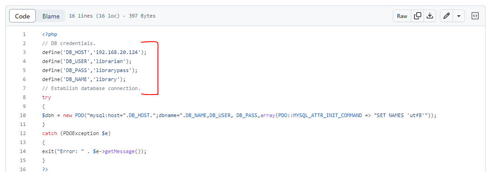
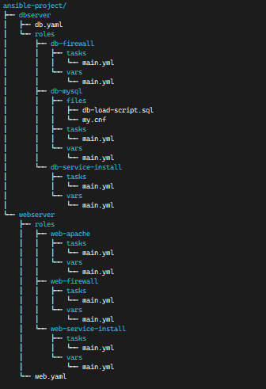

# Ansible Project

## Library project deployment automation

The project requires us to make use of jenkins and ansible to deploy an web application and implement a continuous integration and continuous deployment pipeline. So for my project I used a public repository from github-[Online Library Management System PHP](https://github.com/kumarpandule/Online-Library-Management-System-PHP.git)

This project was forked for my projects use.

I made use of this project and deployed it as a LAMP stack project.

I automated the whole deployment process with the help of ansible.

The project source code required some slight modifications to work for my project. The db connection has been changed as per the following image. 2 files needed this change which are as follows, the `config.php` file in includes and admin/includes directory.

The tree structure shows my ansible playbooks with roles implemented.

The steps taken-

## Step 1

Install 2 centos
machines as webserver that hosts the website and dbserver that hosts the database serve. Also 1 master machine that will host ansible and jenkins. The master machine is a Rocky Linux server.

## Step 2

1. Configure with `nmtui` to make the machines' ip static.

2. Install package pre-requisite packages.

`yum install vim curl wget open-vm-tools -y`
