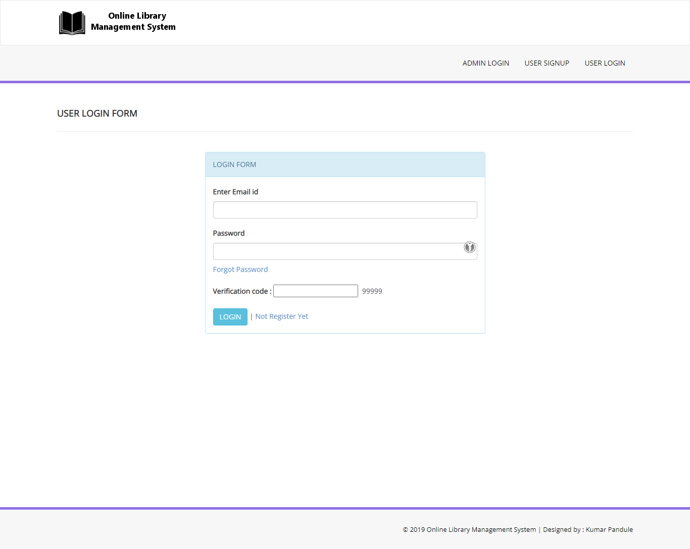

# Ansible Project

## Library project deployment automation

The project requires us to make use of jenkins and ansible to deploy an web application and implement a continuous integration and continuous deployment pipeline. So for my project I used a public repository from github- [Online Library Management System PHP](https://github.com/kumarpandule/Online-Library-Management-System-PHP.git)

This project was forked for my projects use. Furthermore, I made use of this project and deployed it as a LAMP stack project. The process was automated with the help of ansible.

The steps taken-

## Step 1

### Setup VM

Install 2 centos
machines as webserver that hosts the website and dbserver that hosts the database serve. Also 1 master machine that will host ansible and jenkins. The master machine is a Rocky Linux server.

## Step 2

### Setup for ansible

1.  Configure with `nmtui` to make the machines' ip static.

2.  Install package pre-requisite packages.

    `yum install vim curl wget open-vm-tools -y`

3.  Disable selinux by opening `/etc/selinux/config` change `enforcing` to `disabled`

4.  Change hostnames in `/etc/hostname`

5.  Add name resolution in `/etc/hosts`

    ```
        192.168.20.246 rocky-ansible.localdomain rocky-ansible

        192.168.20.135 webserver.localdomain webserver

        192.168.20.124 dbserver.localdomain dbserver
    ```

6.  In master machine create `ssh-keygen` add the key in the client machines in `~/.ssh/authorized_keys`.

7.  To install ansible run

    ```
        yum install epel-release -y
        yum install ansible -y
    ```

8.  In ansible config in `/etc/ansible/ansible.cfg`
    the following lines are changed as such

    

    

    

    ```
    Note: The vault_password_file points to ansible where to find ansible vault password
    ```

9.  In ansible inventory in `/etc/ansible/hosts`
    the following lines are changed as such

    

## Step 3

### Setup for jenkins

1. First we need to add the jenkins repo

   ```
   wget -O /etc/yum.repos.d/jenkins.repo https://pkg.jenkins.io/redhat-stable/jenkins.repo

   rpm --import https://pkg.jenkins.io/redhat-stable/jenkins.io-2023.key

   yum upgrade
   ```

2. Add required dependencies for the jenkins package by installing java

   ```
   sudo yum install java-11-openjdk
   ```

3. Install jenkins and reload the daemon

   ```
   yum install jenkins
   systemctl daemon-reload
   ```

4. Change jenkins defaut port using `vim /usr/lib/systemd/system/jenkins.service` as following

   

5. Start the jenkins service

   ```
   systemctl start jenkins.service
   systemctl enable jenkins.service
   ```

6. Go to the the master machine ip in port 8090. For my case `192.168.20.246:8090` use the password found in `/var/lib/jenkins/secrets/initialAdminPassword` also make a new user. Add Ansible plugin.

7. Some configuration is needed in `Global Tool Configuration`

   

   

   

```
Note: I have also setup jenkins reverse proxy for jenkins using nginx as per the documentation found in the jenkins website.
```

## Step 4

### Github project code modifications

The project source code required some slight modifications to work for my project. The db connection has been changed as per the following image. 2 files needed this change which are as follows, the `config.php` file in includes and admin/includes directory.


## Step 5

### Ansible playbook

1. We will use the command `ansible-galaxy init file-name` to create roles

2. The roles created sum up to the following tree.The tree structure shows my ansible playbooks with roles implemented.

   

   We created dbserver and webserver directory in asible-project. Then we created role directory and created role with the command.

3. For the dbsrver we will run the the roles through the `db.yaml` file.

   ```
   - name: DB Service
     hosts: dbservers
     roles:
         - db-service-install
         - db-firewall
         - db-mysql
   ```

   The db-service-role installs the packages from vars.

   ```
   ---
   - name: Installation packages and services for DB server
     yum:
       name: '{{ item }}'
       state: installed
     loop: '{{ packages }}'
     tags: installation
   ```

   ```
   ---
   packages:
     - libselinux-python
     - libsemanage-python
     - mariadb-server
     - MySQL-python
     - php-mysql
   ```

   The db-firewall role adds rule exception and restarts it.

   ```
   ---
   - name: Start firewalld
     service:
       name: firewalld
       state: started
       enabled: true
     tags: started firewalld

   - name: Insert firewalld rule for mysql
     firewalld:
       port: '{{ mysql_port }}/tcp'
       permanent: true
       immediate: true
       state: enabled
     tags: open port for mysql

   - name: Restart firewalld
     service:
       name: firewalld
       state: reloaded
       enabled: true
     tags: restarted firewalld
   ```

   ```
   ---
   mysql_port: 3306
   ```

   The db-mysql role imports database

   ```
   ---
   - name: Copy mysql configuration file
     copy:
       src: files/my.cnf
       dest: /etc/my.cnf
     tags: mysql conf copy

   - name: Start MariaDB service
     service:
       name: mariadb
       state: started
       enabled: true
     tags: started mariadb

   - name: Create Application Database
     mysql_db:
       name: '{{ dbname }}'
       state: present
     tags: created database

   - name: Create Application DB User
     mysql_user:
       name: '{{ dbuser }}'
       password: '{{ dbpassword }}'
       priv: '*.*:ALL'
       host: '{{ sql_host }}'
       state: present
     tags: created user

   - name: Move db-load-script to db host
     copy:
       src: files/db-load-script.sql
       dest: /tmp/db-load-script.sql
     tags: copy sql

   - name: Load db data
     mysql_db:
       name: library
       encoding: latin1
       target: /tmp/db-load-script.sql
       state: import
     tags: run sql
   ```

   ```
   ---
   dbname: library
   dbuser: librarian
   dbpassword: librarypass
   sql_host: 192.168.20.124
   ```

   ```
   Note: This vars file is encrypted using ansible vault. I used the command-
   ansible-vault encrypt <file-name>
   To decrypt the vault the command-
   ansible-vault decrypt <file-name>
   To edit the vault the command-
   ansible-vault edit <file-name>
   ```

   ```
   GRANT ALL PRIVILEGES ON *.* TO 'librarian'@'192.168.20.135' IDENTIFIED BY
   'librarypass' WITH GRANT OPTION;
   FLUSH PRIVILEGES;
   USE library;

   CREATE TABLE `admin` (
   `id` int(11) NOT NULL,
   `FullName` varchar(100) DEFAULT NULL,
   `AdminEmail` varchar(120) DEFAULT NULL,
   `UserName` varchar(100) NOT NULL,
   `Password` varchar(100) NOT NULL,
   `updationDate` timestamp NOT NULL DEFAULT '0000-00-00 00:00:00' ON UPDATE current_timestamp()
   ) ENGINE=InnoDB DEFAULT CHARSET=latin1;

   --
   -- Dumping data for table `admin`
   --

   INSERT INTO `admin` (`id`, `FullName`, `AdminEmail`, `UserName`, `Password`, `updationDate`) VALUES
   (1, 'Kumar Pandule', 'kumarpandule@gmail.com', 'admin', 'e6e061838856bf47e1de730719fb2609', '2021-06-28 16:06:08');

   -- --------------------------------------------------------

   --
   -- Table structure for table `tblauthors`
   --

   CREATE TABLE `tblauthors` (
   `id` int(11) NOT NULL,
   `AuthorName` varchar(159) DEFAULT NULL,
   `creationDate` timestamp NULL DEFAULT current_timestamp(),
   `UpdationDate` timestamp NULL DEFAULT NULL
   ) ENGINE=InnoDB DEFAULT CHARSET=latin1;

   --
   -- Dumping data for table `tblauthors`
   --

   INSERT INTO `tblauthors` (`id`, `AuthorName`, `creationDate`, `UpdationDate`) VALUES
   (1, 'Kumar Pandule', '2017-07-08 12:49:09', '2021-06-28 16:03:28'),
   (2, 'Kumar', '2017-07-08 14:30:23', '2021-06-28 16:03:35'),
   (3, 'Rahul', '2017-07-08 14:35:08', '2021-06-28 16:03:43'),
   (4, 'HC Verma', '2017-07-08 14:35:21', NULL),
   (5, 'R.D. Sharma ', '2017-07-08 14:35:36', NULL),
   (9, 'fwdfrwer', '2017-07-08 15:22:03', NULL);

   -- --------------------------------------------------------

   --
   -- Table structure for table `tblbooks`
   --

   CREATE TABLE `tblbooks` (
   `id` int(11) NOT NULL,
   `BookName` varchar(255) DEFAULT NULL,
   `CatId` int(11) DEFAULT NULL,
   `AuthorId` int(11) DEFAULT NULL,
   `ISBNNumber` int(11) DEFAULT NULL,
   `BookPrice` int(11) DEFAULT NULL,
   `RegDate` timestamp NULL DEFAULT current_timestamp(),
   `UpdationDate` timestamp NULL DEFAULT NULL
   ) ENGINE=InnoDB DEFAULT CHARSET=latin1;

   --
   -- Dumping data for table `tblbooks`
   --

   INSERT INTO `tblbooks` (`id`, `BookName`, `CatId`, `AuthorId`, `ISBNNumber`, `BookPrice`, `RegDate`, `UpdationDate`) VALUES
   (1, 'PHP And MySql programming', 5, 1, 222333, 20, '2017-07-08 20:04:55', '2017-07-15 05:54:41'),
   (3, 'physics', 6, 4, 1111, 15, '2017-07-08 20:17:31', '2017-07-15 06:13:17');

   -- --------------------------------------------------------

   --
   -- Table structure for table `tblcategory`
   --

   CREATE TABLE `tblcategory` (
   `id` int(11) NOT NULL,
   `CategoryName` varchar(150) DEFAULT NULL,
   `Status` int(1) DEFAULT NULL,
   `CreationDate` timestamp NULL DEFAULT current_timestamp(),
   `UpdationDate` timestamp NULL DEFAULT '0000-00-00 00:00:00'
   ) ENGINE=InnoDB DEFAULT CHARSET=latin1;

   --
   -- Dumping data for table `tblcategory`
   --

   INSERT INTO `tblcategory` (`id`, `CategoryName`, `Status`, `CreationDate`, `UpdationDate`) VALUES
   (4, 'Romantic', 1, '2017-07-04 18:35:25', '2017-07-06 16:00:42'),
   (5, 'Technology', 1, '2017-07-04 18:35:39', '2017-07-08 17:13:03'),
   (6, 'Science', 1, '2017-07-04 18:35:55', '0000-00-00 00:00:00'),
   (7, 'Management', 0, '2017-07-04 18:36:16', '0000-00-00 00:00:00');

   -- --------------------------------------------------------

   --
   -- Table structure for table `tblissuedbookdetails`
   --

   CREATE TABLE `tblissuedbookdetails` (
   `id` int(11) NOT NULL,
   `BookId` int(11) DEFAULT NULL,
   `StudentID` varchar(150) DEFAULT NULL,
   `IssuesDate` timestamp NULL DEFAULT current_timestamp(),
   `ReturnDate` timestamp NULL DEFAULT NULL,
   `RetrunStatus` int(1) DEFAULT NULL,
   `fine` int(11) DEFAULT NULL
   ) ENGINE=InnoDB DEFAULT CHARSET=latin1;

   --
   -- Dumping data for table `tblissuedbookdetails`
   --

   INSERT INTO `tblissuedbookdetails` (`id`, `BookId`, `StudentID`, `IssuesDate`, `ReturnDate`, `RetrunStatus`, `fine`) VALUES
   (1, 1, 'SID002', '2017-07-15 06:09:47', '2017-07-15 11:15:20', 1, 0),
   (2, 1, 'SID002', '2017-07-15 06:12:27', '2017-07-15 11:15:23', 1, 5),
   (3, 3, 'SID002', '2017-07-15 06:13:40', NULL, 0, NULL),
   (4, 3, 'SID002', '2017-07-15 06:23:23', '2017-07-15 11:22:29', 1, 2),
   (5, 1, 'SID009', '2017-07-15 10:59:26', NULL, 0, NULL),
   (6, 3, 'SID011', '2017-07-15 18:02:55', NULL, 0, NULL);

   -- --------------------------------------------------------

   --
   -- Table structure for table `tblstudents`
   --

   CREATE TABLE `tblstudents` (
   `id` int(11) NOT NULL,
   `StudentId` varchar(100) DEFAULT NULL,
   `FullName` varchar(120) DEFAULT NULL,
   `EmailId` varchar(120) DEFAULT NULL,
   `MobileNumber` char(11) DEFAULT NULL,
   `Password` varchar(120) DEFAULT NULL,
   `Status` int(1) DEFAULT NULL,
   `RegDate` timestamp NULL DEFAULT current_timestamp(),
   `UpdationDate` timestamp NULL DEFAULT NULL
   ) ENGINE=InnoDB DEFAULT CHARSET=latin1;

   --
   -- Dumping data for table `tblstudents`
   --

   INSERT INTO `tblstudents` (`id`, `StudentId`, `FullName`, `EmailId`, `MobileNumber`, `Password`, `Status`, `RegDate`, `UpdationDate`) VALUES
   (1, 'SID002', 'Anuj kumar', 'anuj.lpu1@gmail.com', '9865472555', 'f925916e2754e5e03f75dd58a5733251', 1, '2017-07-11 15:37:05', '2017-07-15 18:26:21'),
   (4, 'SID005', 'sdfsd', 'csfsd@dfsfks.com', '8569710025', '92228410fc8b872914e023160cf4ae8f', 0, '2017-07-11 15:41:27', '2017-07-15 17:43:03'),
   (8, 'SID009', 'test', 'test@gmail.com', '2359874527', 'f925916e2754e5e03f75dd58a5733251', 1, '2017-07-11 15:58:28', '2017-07-15 13:42:44'),
   (9, 'SID010', 'Amit', 'amit@gmail.com', '8585856224', 'f925916e2754e5e03f75dd58a5733251', 1, '2017-07-15 13:40:30', NULL),
   (10, 'SID011', 'Sarita Pandey', 'sarita@gmail.com', '4672423754', 'f925916e2754e5e03f75dd58a5733251', 1, '2017-07-15 18:00:59', NULL);

   --
   -- Indexes for dumped tables
   --

   --
   -- Indexes for table `admin`
   --
   ALTER TABLE `admin`
   ADD PRIMARY KEY (`id`);

   --
   -- Indexes for table `tblauthors`
   --
   ALTER TABLE `tblauthors`
   ADD PRIMARY KEY (`id`);

   --
   -- Indexes for table `tblbooks`
   --
   ALTER TABLE `tblbooks`
   ADD PRIMARY KEY (`id`);

   --
   -- Indexes for table `tblcategory`
   --
   ALTER TABLE `tblcategory`
   ADD PRIMARY KEY (`id`);

   --
   -- Indexes for table `tblissuedbookdetails`
   --
   ALTER TABLE `tblissuedbookdetails`
   ADD PRIMARY KEY (`id`);

   --
   -- Indexes for table `tblstudents`
   --
   ALTER TABLE `tblstudents`
   ADD PRIMARY KEY (`id`),
   ADD UNIQUE KEY `StudentId` (`StudentId`);

   --
   -- AUTO_INCREMENT for dumped tables
   --

   --
   -- AUTO_INCREMENT for table `admin`
   --
   ALTER TABLE `admin`
   MODIFY `id` int(11) NOT NULL AUTO_INCREMENT, AUTO_INCREMENT=2;

   --
   -- AUTO_INCREMENT for table `tblauthors`
   --
   ALTER TABLE `tblauthors`
   MODIFY `id` int(11) NOT NULL AUTO_INCREMENT, AUTO_INCREMENT=10;

   --
   -- AUTO_INCREMENT for table `tblbooks`
   --
   ALTER TABLE `tblbooks`
   MODIFY `id` int(11) NOT NULL AUTO_INCREMENT, AUTO_INCREMENT=4;

   --
   -- AUTO_INCREMENT for table `tblcategory`
   --
   ALTER TABLE `tblcategory`
   MODIFY `id` int(11) NOT NULL AUTO_INCREMENT, AUTO_INCREMENT=8;

   --
   -- AUTO_INCREMENT for table `tblissuedbookdetails`
   --
   ALTER TABLE `tblissuedbookdetails`
   MODIFY `id` int(11) NOT NULL AUTO_INCREMENT, AUTO_INCREMENT=7;

   --
   -- AUTO_INCREMENT for table `tblstudents`
   --
   ALTER TABLE `tblstudents`
   MODIFY `id` int(11) NOT NULL AUTO_INCREMENT, AUTO_INCREMENT=11;
   COMMIT;
   ```

   ```
   [mysqld]
   datadir=/var/lib/mysql
   socket=/var/lib/mysql/mysql.sock
   symbolic-links=0
   [mysqld_safe]
   log-error=/var/log/mariadb/mariadb.log
   pid-file=/var/run/mariadb/mariadb.pid
   !includedir /etc/my.cnf.d
   ```

4. For the websrver we will run the the roles through the `web.yaml` file.

   ```
   - name: Web Service
     hosts: webservers
     roles:
       - web-service-install
       - web-firewall
       - web-apache
   ```

   The web-service-install role is for installation

   ```
   ---
   - name: Installation packages and services for Web server
     yum:
       name: '{{ item }}'
       state: installed
     loop: '{{ packages }}'
     tags: installaton
   ```

   ```
   ---
   packages:
   - libselinux-python
   - libsemanage-python
   - httpd
   - git
   - php
   - php-mysql
   ```

   The web-firewall role allows exception for port 80 and 3306

   ```
   ---
   - name: Start firewalld
     service:
       name: firewalld
       state: started
       enabled: true
     tags: started firewalld

   - name: Insert firewalld rule for apache
     firewalld:
       port: '{{ httpd_port }}/tcp'
       permanent: true
       immediate: true
       state: enabled
     tags: open port for apache

   - name: Insert firewalld rule for mysql
     firewalld:
       port: '{{ mysql_port }}/tcp'
       permanent: true
       immediate: true
       state: enabled
     tags: open port for mysql
   ```

   ```
   ---
   httpd_port: 80
   mysql_port: 3306
   ```

   The web-apache role configures apache and sets up the webpage

   ```
   ---
   - name: document root exist
     file:
       path: '/var/www/{{ http_host }}'
       state: directory
       owner: root
       mode: '0755'
     tags: make root directory

   - name: Set index.php as the default page
     replace:
       path: /etc/httpd/conf/httpd.conf
       regexp: 'DirectoryIndex index.html'
       replace: '#DirectoryIndex index.html \nDirectoryIndex index.php'
     tags: changed apache index from html to php file

   - name: Start Apache service
     service:
       name: httpd
       enabled: true
       state: started
     tags: started apache

   - name: Configuration of apache server
     template:
       src: myconf.conf.j2
       dest: '/etc/httpd/conf.d/{{http_host}}.conf'
       mode: '0644'
     notify: apache restart
     tags: configure apache

   - name: Copy the code from repository
     git:
       repo: '{{ repository }}'
       dest: '/var/www/{{ http_host }}/'
       force: true
     tags: copy repo
   ```

   ```
   ---
   # This is a handler
   - name: apache restart
   service:
       name: httpd
       state: restarted
   tags: restarted apache
   ```

   ```
   # This is a virtual host configuration file using jinja2
   <VirtualHost *:80>
       ServerName {{ server }}
       ServerAlias {{http_host}}
       DocumentRoot /var/www/{{http_host}}
       ErrorLog /var/www/{{http_host}}/error.log
       CustomLog /var/www/{{http_host}}/requests.log combined

       <Directory /var/www/{{http_host}}>
       Options Indexes FollowSymLinks
       AllowOverride None
       Require all granted
   </Directory>
   </VirtualHost>
   ```

   ```
   ---
   http_host: library.com
   server: 192.168.20.135
   repository: https://github.com/AbirHossainDevOps/library.git
   ```

## Step 5

### Jenkins work

1. We have to create a pipeline project
   

   

2. Now doing the following

   

   

   In the pipeline script I created this script using pipeline-syntax module from jenkins.

   ```
   pipeline {
       agent any

       stages {
           stage('Git playbook ✨') {
               steps {
                   git branch: 'main', credentialsId: '12c630aa-5df4-4da9-b530-3b2c6404cf61', url: 'https://github.com/AbirHossainDevOps/library.git'
               }

           }
           stage('Ansible web playbook 🎉') {
               steps {
                   ansiblePlaybook become: true, credentialsId: '12c630aa-5df4-4da9-b530-3b2c6404cf61', installation: 'ansible', inventory: '/etc/ansible/hosts', playbook: '/opt/ansible-project/webserver/web.yaml'
                   echo 'DONE with the webpage👌'
               }
           }
           stage('Ansible db playbook 🙏') {
               steps {

                   sh 'sudo ansible-playbook /opt/ansible-project/dbserver/db.yaml --vault-password-file /opt/pass.txt '
                   echo 'DONE with the db 🙌'
               }
           }
       }
   }

   ```

3. By using `Build Now` we run the pipeline

   

   

   

4. Now to demonstrate the cronjob working we will make some changes in the repo. The job is scheduled in such a way that after every 2 minutes jenkins looks for chages in the remote repo and if there are chages it will rerun the pipeline again.
   

   

   

   

## The website

The website look as such




